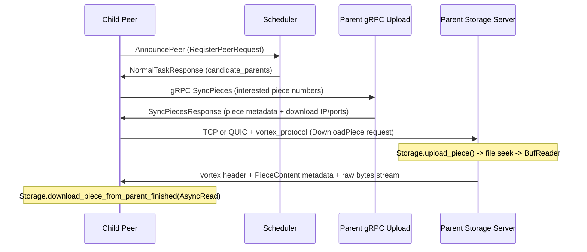
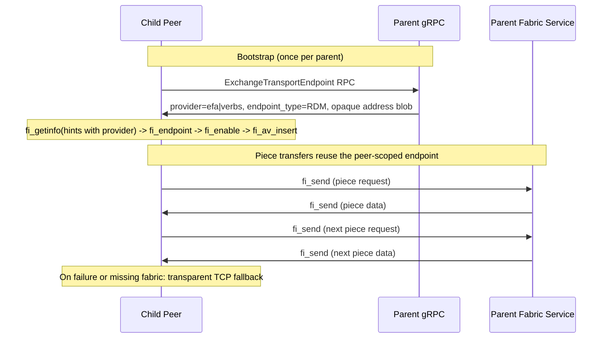

# Multi-Provider RDMA P2P Transfer for Dragonfly: Feasibility Assessment

## Verdict: Feasible — libfabric is the common abstraction across all GPU cloud providers

The Dragonfly codebase has **deliberate groundwork** for RDMA P2P transfers -- stubs, comments, and API definitions that show the maintainers planned for it. The `Downloader` trait provides a clean protocol abstraction. After surveying the RDMA landscape across AWS, GCP, Azure, CoreWeave, and on-prem NVIDIA clusters, the conclusion is:

- The existing code is good evidence of **RDMA intent**.
- The current shared API (`IBVerbsQueuePairEndpoint`) is **too IB-specific** to serve as a universal contract — it doesn't cover AWS EFA, and it's unnecessarily narrow even for IB/RoCE.
- There is **no single wire protocol** across all providers (AWS uses EFA/SRD, GCP uses RoCEv2, Azure uses InfiniBand, CoreWeave uses IB or RoCE, on-prem varies).
- **libfabric (OFI)** is the closest common userspace API: the `efa` provider covers AWS, and the `verbs` provider covers IB/RoCE environments (GCP, Azure, CoreWeave, on-prem).
- The design should be **provider-neutral at the API and Downloader layer**, with libfabric handling provider selection at runtime.

---

## 1. Existing Groundwork in the Codebase

### API Layer (dragonfly-api crate, external repo)

- In external `[pkg/apis/dfdaemon/v2/dfdaemon.proto](https://github.com/dragonflyoss/api/blob/main/pkg/apis/dfdaemon/v2/dfdaemon.proto)`, `IBVerbsQueuePairEndpoint` currently contains only:
  - `num`
  - `lid`
  - `gid`
- The RPC is real and already defined: `ExchangeIBVerbsQueuePairEndpoint`.
- In the same proto, `SyncPiecesResponse` only returns `ip`, `tcp_port`, and `quic_port`, with a comment saying the IP may be reused for RDMA bootstrap.
- In external `[pkg/apis/common/v2/common.proto](https://github.com/dragonflyoss/api/blob/main/pkg/apis/common/v2/common.proto)`, `Host` and `Network` do **not** have an RDMA or EFA capability field today.

**Implication**: the shared API already hints at RDMA, but it only exposes a thin **IB-oriented bootstrap sketch**. It does not yet provide a transport-neutral endpoint exchange or a host capability signal suitable for a multi-provider production path.

### Client gRPC Server ([dfdaemon_upload.rs](dragonfly/client/dragonfly-client/src/grpc/dfdaemon_upload.rs))

- Server method stub exists but returns `unimplemented!()`:

```2438:2445:dragonfly/client/dragonfly-client/src/grpc/dfdaemon_upload.rs
    // Exchanges the ib verbs queue pair endpoint.
    #[instrument(skip_all, fields(num, lid, gid))]
    async fn exchange_ib_verbs_queue_pair_endpoint(
        &self,
        _request: Request<ExchangeIbVerbsQueuePairEndpointRequest>,
    ) -> Result<Response<ExchangeIbVerbsQueuePairEndpointResponse>, Status> {
        unimplemented!()
    }
```

- Client wrapper (`DfdaemonUploadClient::exchange_ib_verbs_queue_pair_endpoint`) is fully wired and ready to call.

### Piece Collector ([piece_collector.rs](dragonfly/client/dragonfly-client/src/resource/piece_collector.rs))

- Comment explicitly mentions RDMA:

```45:46:dragonfly/client/dragonfly-client/src/resource/piece_collector.rs
    // IP is used to indicate the IP address of the peer. If protocol is rdma,
    // the IP is used to exchange the queue pair endpoint of IBVerbs.
```

### Debug Docker Image ([Dockerfile.debug](dragonfly/client/ci/Dockerfile.debug))

- Already installs `infiniband-diags` and `ibverbs-utils` packages.

### Downloader Trait ([piece_downloader.rs](dragonfly/client/dragonfly-client/src/resource/piece_downloader.rs))

- Clean protocol abstraction via `Downloader` trait and `DownloaderFactory`:

```77:93:dragonfly/client/dragonfly-client/src/resource/piece_downloader.rs
    pub fn new(protocol: &str, config: Arc<Config>) -> Result<Self> {
        let downloader: Arc<dyn Downloader> = match protocol {
            "tcp" => Arc::new(TCPDownloader::new(/* ... */)),
            "quic" => Arc::new(QUICDownloader::new(/* ... */)),
            _ => {
                error!("unsupported protocol: {}", protocol);
                return Err(Error::InvalidParameter);
            }
        };
        Ok(Self { downloader })
    }
```

---

## 2. Current P2P Data Flow (deep dive)




### Critical data-path details that affect RDMA design

**Server side** (how piece bytes are produced): The TCP server in [server/tcp.rs](dragonfly/client/dragonfly-client-storage/src/server/tcp.rs) calls `Storage.upload_piece()` which returns `impl AsyncRead` -- either from in-memory LRU cache (`Bytes`) or from disk via `BufReader` with file seek. The server then does `tokio::io::copy(reader, tcp_writer)` to stream piece bytes. This is a kernel-mediated path: file -> page cache -> userspace buffer -> kernel TCP stack -> NIC.

**Client side** (how piece bytes are consumed): The `Downloader` trait returns `(Box<dyn AsyncRead + Send + Unpin>, u64, String)`. The caller in [piece.rs](dragonfly/client/dragonfly-client/src/resource/piece.rs) passes this `AsyncRead` to `Storage.download_piece_from_parent_finished()` which writes the bytes to a file on disk.

**Connection lifecycle**: Both `TCPClient` and `QUICClient` create a **new connection per piece download**. The pool in `piece_downloader.rs` caches `Client` objects (lightweight config+addr wrappers), **not actual transport connections**. Each `download_piece()` call results in `TcpStream::connect()` or `Endpoint::connect()`.

---

## 3. Design Challenges (revised, with deeper analysis)

### Challenge 1: AsyncRead impedance mismatch

The `Downloader` trait returns `Box<dyn AsyncRead>`. RDMA doesn't produce a byte stream -- it writes data into a **pre-registered memory buffer** (Memory Region) and signals completion via a Completion Queue. Adapting this to `AsyncRead` requires wrapping the received buffer as a `Cursor<Bytes>`.

**Impact**: This costs one extra memcpy in userspace. However, the main RDMA benefit -- **OS bypass** (eliminating the kernel TCP/IP stack, context switches, and interrupt overhead) -- is fully preserved. For 4-64 MB pieces, the userspace memcpy is negligible (~~1-2us for 64 MB on modern CPUs with cache-line prefetch) compared to the kernel stack elimination (~~50-100us saved per piece). **This is acceptable for phase 1.**

True zero-copy would require evolving `Storage` to accept registered memory buffers directly, which is a much larger change.

### Challenge 2: Connection model must differ from TCP/QUIC

Both TCP and QUIC create new connections per piece. RDMA Queue Pair creation is **far more expensive** (involves kernel uverbs ioctls, device resource allocation, state machine transitions: RESET -> INIT -> RTR -> RTS). Creating a new QP per piece would **negate most of the RDMA benefit**.

**Required change**: The `RDMAClient` must internally maintain **persistent, pooled QP connections** to peers. Multiple piece downloads should reuse the same QP via RDMA Send/Recv operations. This is a fundamentally different connection model from the existing TCP/QUIC pattern, even though the `Downloader` trait interface stays the same.

### Challenge 3: RDMA transfer protocol design

Two approaches for the actual data transfer:

- **RDMA Send/Recv (two-sided)**: Simpler. Client posts recv buffer, server reads piece from storage into registered buffer and posts send. Requires both sides to be active. This is essentially "TCP over RDMA" -- same request/response model as vortex_protocol, just over RDMA QPs instead of TCP sockets. Piece metadata (offset, digest) can be sent as a header in the same RDMA message.
- **RDMA Write (one-sided)**: More complex but higher performance. Server writes directly into client's registered memory using rkey. Client only polls its CQ for completion. Requires exchanging memory region keys via the QP exchange RPC. More coordination complexity.

**Recommendation**: RDMA Send/Recv for phase 1. The two-sided model maps cleanly to the existing request/response pattern and avoids the complexity of remote memory registration exchange.

### Challenge 4: The Piece struct eagerly creates downloaders

```98:103:dragonfly/client/dragonfly-client/src/resource/piece.rs
        Ok(Self {
            config: config.clone(),
            storage,
            tcp_downloader: piece_downloader::DownloaderFactory::new("tcp", config.clone())?.build(),
            quic_downloader: piece_downloader::DownloaderFactory::new("quic", config)?.build(),
            ...
        })
```

The `Piece` struct creates both TCP and QUIC downloaders **eagerly at startup**. Adding RDMA here would fail on machines without RDMA devices. The RDMA downloader must be **lazily initialized and optional** -- created only when an RDMA device is detected. This changes `Piece` to hold `Option<Arc<dyn Downloader>>` for RDMA and adds conditional logic to the protocol routing.

### Challenge 5: The shared API is too IB-specific for a multi-provider design

The `dragonfly-api` crate is published from the separate [dragonflyoss/api](https://github.com/dragonflyoss/api) repository. After inspecting the actual proto, the bootstrap message is narrower than expected:

- `IBVerbsQueuePairEndpoint` exposes only `num`, `lid`, and `gid`
- For classic RC-style verbs bootstrap, that is already **thin** because remote PSN is usually part of the peer exchange
- For AWS EFA, it is the **wrong abstraction entirely**, because libfabric applications bootstrap by exchanging an **opaque endpoint address blob** from `fi_getname()`, not `num/lid/gid`
- Even for GCP RoCEv2 or Azure IB environments, a libfabric-based design still prefers opaque address exchange over hand-rolled QP parameters

This means the shared API repo is not just a coordination dependency — it is a **design prerequisite** for any multi-provider path. The bootstrap contract must be **transport-neutral**: an opaque address blob + provider kind + capability bits, not a provider-specific tuple.

### Challenge 6: Provider heterogeneity — no single wire protocol

Each cloud provider offers a different high-performance interconnect for NVIDIA GPU instances:


| Provider      | Wire protocol | libfabric provider | NIC hardware        | Typical GPU instance         |
| ------------- | ------------- | ------------------ | ------------------- | ---------------------------- |
| **AWS**       | EFA / SRD     | `efa`              | EFA device (custom) | p4d, p5, trn1/trn2           |
| **GCP**       | RoCEv2        | `verbs`            | ConnectX MRDMA      | A3 Ultra, A4, A4X            |
| **Azure**     | InfiniBand    | `verbs`            | ConnectX-5/6/7      | ND-series (NDv2, NDv4, NDv5) |
| **CoreWeave** | IB or RoCE    | `verbs`            | ConnectX-6/7        | HGX A100/H100                |
| **On-prem**   | IB or RoCE    | `verbs`            | ConnectX-5/6/7      | DGX, HGX, custom             |


Key differences that affect design:

- AWS EFA uses **SRD** (Scalable Reliable Datagram) semantics under the hood, not RC QPs. The libfabric `efa` provider adds software reassembly for large messages. A raw-verbs design would need to handle MTU-sized fragmentation manually.
- GCP RoCEv2 runs over Ethernet with PFC/ECN congestion control. The `verbs` provider works, but the network is lossless Ethernet, not switched IB fabric.
- Azure and CoreWeave IB instances provide a classic switched IB fabric where raw verbs or the libfabric `verbs` provider both work.

**Implication**: the only API that spans all five environments without per-provider code paths at the application layer is **libfabric**. The `efa` provider handles AWS; the `verbs` provider handles everything else. The application sees the same `fi_send`/`fi_recv` interface regardless.

### Challenge 7: No existing capability signal for the scheduler

Today the scheduler can score peers by IDC, location, and bandwidth, but not by transport capability:

- `Host` has `ip`, `port`, `download_port`, `proxy_port`, etc.
- `Network` has bandwidth and topology hints
- Neither message can currently advertise "supports fabric transport" or which provider is available

Without a shared API change, scheduler-side transport affinity would remain out of scope. The capability signal needs to be **provider-neutral** (e.g., `fabric_provider: "efa"` or `fabric_provider: "verbs"`) so that the scheduler can match children to parents that share the same high-performance transport, regardless of which cloud they are in.

---

## 4. Revised Architecture (provider-neutral via libfabric)




### Provider auto-detection at startup

```
fi_getinfo(NULL hints)  →  enumerate available providers
  ├─ "efa"   found?  →  AWS environment, use efa provider
  ├─ "verbs" found?  →  IB/RoCE environment (GCP, Azure, CoreWeave, on-prem)
  └─ neither found   →  no fabric available, TCP/QUIC only
```

The detected provider name becomes part of the host's capability advertisement so the scheduler and peers know what transport is available.

### Key differences from TCP/QUIC

- The bootstrap exchanges a **provider-opaque address blob**, not an IB-specific tuple or provider-specific fields
- A peer-scoped endpoint is created **once** and reused across many piece downloads (versus per-piece connections for TCP/QUIC)
- libfabric handles large-message segmentation/reassembly internally (critical for both `efa` and `verbs` providers), so Dragonfly does not need to fragment pieces at the application layer
- Fallback remains essential: if libfabric bootstrap fails, hardware is unavailable, or the peer doesn't support the same provider, the client transparently falls back to TCP
- Two peers must share the **same provider** to use fabric transport (an `efa` child cannot fabric-connect to a `verbs` parent)

---

## 5. API Choice: Why libfabric is the multi-provider answer

The alternatives and why each falls short for a cross-provider design:


| Approach             | AWS (EFA)                      | GCP (RoCEv2)           | Azure (IB)             | CoreWeave              | On-prem                | Verdict           |
| -------------------- | ------------------------------ | ---------------------- | ---------------------- | ---------------------- | ---------------------- | ----------------- |
| **Raw libibverbs**   | No (EFA is not standard verbs) | Yes                    | Yes                    | Yes                    | Yes                    | Excludes AWS      |
| **AWS EFA-specific** | Yes                            | No                     | No                     | No                     | No                     | AWS-only          |
| **libfabric**        | Yes (`efa` provider)           | Yes (`verbs` provider) | Yes (`verbs` provider) | Yes (`verbs` provider) | Yes (`verbs` provider) | **All providers** |


**Recommendation: libfabric (OFI) as the single transport abstraction.**

Why libfabric works as the common layer:

- **AWS**: the `efa` provider is the native, AWS-supported abstraction for EFA application development. It handles SRD-specific segmentation and reassembly for large messages.
- **GCP/Azure/CoreWeave/on-prem**: the `verbs` provider translates OFI calls to libibverbs + librdmacm, supporting InfiniBand and RoCEv2 transparently.
- **Bootstrap model**: all providers use the same `fi_getname()` -> opaque address exchange -> `fi_av_insert()` pattern. The application never deals with provider-specific QP parameters.
- **Endpoint type**: `FI_EP_RDM` (reliable datagram) is supported by both `efa` and `verbs` providers and provides the reliability guarantees Dragonfly needs without connection-oriented overhead.
- Treat the current `ExchangeIBVerbsQueuePairEndpoint` RPC as evidence of prior RDMA intent, not as the contract to build around.

What this costs:

- ~~The Rust ecosystem for libfabric is weaker than for raw verbs bindings.~~ **Update**: the libfabric project now ships official Rust bindings (`[ofi-libfabric-sys](https://github.com/ofiwg/libfabric/tree/main/bindings/rust)`, v0.1.0, edition 2024). This is a raw `-sys` crate (bindgen-generated FFI), not a safe abstraction — but it eliminates the hardest part of the Rust integration (correct FFI, `static inline` wrappers, linking). Dragonfly would depend on `ofi-libfabric-sys` and write a thin safe wrapper on top, rather than building FFI from scratch.
- The safe wrapper layer on top of `ofi-libfabric-sys` is still needed (lifetime management, buffer pools, completion helpers), but this is significantly less work than raw FFI.
- The shared API needs a **new transport-neutral message** rather than a small additive change to the existing IB-specific one.
- Testing across all providers requires access to real hardware on each cloud (SoftRoCE covers the `verbs` path for CI, but `efa` requires real AWS instances).

---

## 6. Per-Provider Considerations

### AWS (EFA)

- **Instance types**: Only EFA-supported types (p4d, p5, trn1, trn2, etc.)
- **Security group**: Must allow all traffic within the placement group
- **Placement group**: Peers should be in the same cluster placement group for optimal latency
- **libfabric provider**: `efa` (standard). Prefer over `efa-direct` for v1 because Dragonfly moves large pieces, and `efa-direct` pushes MTU-sized fragmentation back onto the application.
- **Software stack**: EFA kernel driver + rdma-core (v24+) + libfabric + aws-ofi-nccl plugin (for NCCL, not directly needed by Dragonfly but relevant to the ecosystem)
- **Network topology**: Within a single AZ / placement group. Cross-AZ EFA is not supported.

### GCP (RoCEv2)

- **Instance types**: A3 Ultra (H200), A4 (B200), A4X (GB200), A4X Max (GB300 Ultra)
- **NIC**: MRDMA (Mellanox ConnectX) — 8 RDMA-capable NICs per node on A3 Ultra / A4
- **Network**: Dedicated RDMA VPC with `ZONE-vpc-roce` profile, 8896 MTU, single-zone only
- **libfabric provider**: `verbs` over RoCE
- **Legacy**: older A3 Mega used GPUDirect-TCPXO; newer series use native RoCE v2
- **Constraint**: RDMA network is isolated — peers must be in the same RDMA VPC and zone

### Azure (InfiniBand)

- **Instance types**: ND-series — NDv2 (V100), NDv4 (A100), NDv5 (H100/H200)
- **NIC**: ConnectX-5/6/7 InfiniBand HCAs
- **Network**: Switched InfiniBand fabric, non-blocking
- **libfabric provider**: `verbs` over IB
- **Software stack**: Mellanox OFED 5.1+, pre-configured on Azure HPC VM images
- **Deployment**: Works on raw VMs and AKS (via NVIDIA Network Operator)

### CoreWeave (IB or RoCE)

- **IB clusters**: NVIDIA Quantum HDR/NDR switches, CX-6 HCAs on HGX A100 nodes. Non-blocking fat-tree.
- **RoCE clusters**: Spectrum-X Ethernet fabric on newer GPU types
- **libfabric provider**: `verbs` (for both IB and RoCE)
- **Kubernetes**: RDMA resources requested via `rdma/ib: 1`; RoCE requires Multus CNI + NetworkAttachmentDefinition
- **Labels**: automatic topology labels (`backend.coreweave.cloud/`*, `ib.coreweave.cloud/`*)

### On-prem NVIDIA clusters (DGX / HGX / custom)

- **Network**: typically InfiniBand (HDR 200G or NDR 400G), sometimes RoCEv2 on Ethernet-only fabrics
- **NIC**: ConnectX-6 or ConnectX-7
- **libfabric provider**: `verbs`
- **Flexibility**: most control over OFED version, subnet manager, and MTU. Easiest environment for development and testing.

### Common across all providers

- **Intra-node**: NVLink / NVSwitch (not relevant to Dragonfly P2P, which is inter-node)
- **GPUDirect RDMA**: optional capability on all providers. Not in initial scope — CPU-mediated fabric transfer first. GPUDirect can be added later via libfabric `FI_HMEM` support.
- **Capability advertisement**: the shared API needs a provider-neutral field so hosts can advertise their fabric transport. This is a prerequisite for scheduler affinity.

---

## 7. Expected Performance Gains

For intra-cluster piece transfer (same placement group / subnet):

- **Latency**: ~50-100us (TCP kernel stack) down to ~1-5us (RDMA OS bypass). Most impactful for small pieces and high piece counts.
- **CPU overhead**: TCP consumes significant CPU for copies, interrupts, and syscalls. RDMA/fabric offloads to NIC hardware, freeing CPU for application work.
- **Model distribution**: For a 70B parameter model (~140 GB), intra-cluster P2P distribution could drop from minutes to seconds.

Per-provider throughput comparison:


| Provider      | Instance    | Aggregate NIC BW    | TCP single-stream | Fabric single-endpoint | Notes             |
| ------------- | ----------- | ------------------- | ----------------- | ---------------------- | ----------------- |
| **AWS**       | p5.48xlarge | 3,200 Gbps (EFA v2) | ~10-25 Gbps       | ~100+ Gbps             | 32 EFA interfaces |
| **GCP**       | A3 Ultra    | 3,600 Gbps          | ~10-25 Gbps       | ~100+ Gbps             | 8 MRDMA NICs      |
| **GCP**       | A4          | 3,600 Gbps          | ~10-25 Gbps       | ~100+ Gbps             | 8 MRDMA NICs      |
| **Azure**     | ND H100 v5  | 3,200 Gbps (IB NDR) | ~10-25 Gbps       | ~100+ Gbps             | 8 CX-7 HCAs       |
| **CoreWeave** | HGX H100    | 3,200 Gbps (IB NDR) | ~10-25 Gbps       | ~100+ Gbps             | 8 CX-7 HCAs       |
| **On-prem**   | DGX H100    | 3,200 Gbps (IB NDR) | ~10-25 Gbps       | ~100+ Gbps             | 8 CX-7 HCAs       |


The throughput benefit is consistent across providers because the underlying advantage is the same: OS bypass eliminating kernel TCP/IP stack overhead. The exact NIC hardware and wire protocol differ, but libfabric abstracts this away.

---

## 8. Key Risks (revised for multi-provider scope)

- **Hardware dependency**: Must gracefully fall back to TCP when fabric hardware is unavailable. The `Piece` struct must treat the fabric downloader as optional. Provider auto-detection (`fi_getinfo`) must not crash or block on machines without RDMA devices.
- **External API repo**: A shared API change is a **prerequisite**, not optional. The current `ExchangeIBVerbsQueuePairEndpoint` message is too narrow and too IB-specific for any multi-provider design.
- **Transport-neutral bootstrap design**: The endpoint exchange must carry an opaque libfabric address + provider kind + capability bits without painting the API into a provider-specific corner. Getting this contract right is the single most important design decision.
- **Rust userspace fabric stack**: ~~Libfabric integration in Rust is greenfield.~~ **Update**: the official `[ofi-libfabric-sys](https://github.com/ofiwg/libfabric/tree/main/bindings/rust)` crate (v0.1.0, March 2026) provides raw FFI bindings via bindgen. This eliminates the FFI risk. A safe wrapper layer is still needed on top for lifetime management, buffer pools, and completion helpers. The wrapper must handle provider-specific quirks (e.g., EFA `FI_EP_RDM` vs verbs `FI_EP_RDM` may have different completion semantics).
- **Multi-provider testing matrix**: Each provider requires different test infrastructure:
  - **CI / dev**: SoftRoCE (`rdma_rxe` kernel module) for the `verbs` path on commodity Linux — free, automatable
  - **AWS**: real EFA-enabled instances (p4d/p5) for the `efa` path — not free, needs cloud CI budget
  - **GCP**: MRDMA instances with RDMA VPC for RoCEv2 — requires specific A3 Ultra / A4 instances
  - **Azure**: ND-series with IB — requires ND GPU VMs
  - **CoreWeave**: IB or RoCE nodes — requires CoreWeave account
  - **Risk**: it is easy to ship a change that works on SoftRoCE but breaks on EFA, or vice versa
- **Provider negotiation failure**: Two peers in the same cluster could theoretically have different providers (unlikely but possible in hybrid setups). The bootstrap must handle negotiation failure gracefully.
- **Memory registration**: Registered buffers must be pooled and reused regardless of provider. Even with libfabric, memory handling and completion progress need careful tuning.
- **Platform**: Linux-only. Needs `#[cfg(target_os = "linux")]` gating throughout. No Windows/macOS support for fabric transport.

---

## 9. Phased Implementation Roadmap

### Phase 0 (prerequisite): Design the transport-neutral shared API

- Inspect the current messages in `[pkg/apis/dfdaemon/v2/dfdaemon.proto](https://github.com/dragonflyoss/api/blob/main/pkg/apis/dfdaemon/v2/dfdaemon.proto)` and `[pkg/apis/common/v2/common.proto](https://github.com/dragonflyoss/api/blob/main/pkg/apis/common/v2/common.proto)`
- Add a new `ExchangeTransportEndpoint` RPC (or rename/supersede `ExchangeIBVerbsQueuePairEndpoint`) with a **transport-neutral** bootstrap message:
  - `fabric_provider` string: `"efa"`, `"verbs"`, or future providers
  - `endpoint_type` string: `"RDM"` (recommended default)
  - `endpoint_address` bytes: opaque blob from `fi_getname()`
  - `capabilities` uint64: bitmask for future extensibility (send/recv, rma, hmem/gpudirect, etc.)
- Add a `fabric_provider` field to `Host` or `Network` so peers and the scheduler know which transport is available
- Keep the existing `ExchangeIBVerbsQueuePairEndpoint` for backward compatibility but mark as deprecated

### Phase 1: Build a safe Rust wrapper on top of `ofi-libfabric-sys`

- Add `[ofi-libfabric-sys](https://github.com/ofiwg/libfabric/tree/main/bindings/rust)` as a dependency (official libfabric Rust FFI bindings, v0.1.0, edition 2024). This provides raw bindgen-generated access to the entire libfabric C API under `ofi_libfabric_sys::bindgen`.
- Build a **safe Rust abstraction layer** on top of the raw `-sys` crate, covering the core lifecycle: `fi_getinfo`, fabric, domain, endpoint, completion queue, address vector, and memory registration. Each C resource gets a Rust wrapper with `Drop` for cleanup.
- Build reusable registered-buffer pools and completion progress helpers
- Implement provider auto-detection: call `fi_getinfo(NULL)` and select the best available provider
- **Must work with both `efa` and `verbs` providers** — test with SoftRoCE (`verbs`) in CI and real EFA on AWS
- Keep the implementation Linux-only (`#[cfg(target_os = "linux")]`)
- ~800-1,200 lines (reduced from earlier estimate since FFI bindings are now provided by the official crate)

### Phase 2: Implement peer bootstrap and endpoint reuse

- Add the new `ExchangeTransportEndpoint` RPC to the shared API and wire server/client support into [dfdaemon_upload.rs](dragonfly/client/dragonfly-client/src/grpc/dfdaemon_upload.rs)
- Exchange opaque libfabric endpoint addresses out of band
- Build peer-scoped endpoint reuse keyed by parent address instead of per-piece transport setup
- Handle **provider mismatch** gracefully: if child has `efa` but parent has `verbs` (or vice versa), fall back to TCP
- ~500-800 lines

### Phase 3: Implement `FabricDownloader` and fabric data-plane handling

- Implement `FabricDownloader` behind the existing `Downloader` trait (renamed from `EFADownloader` to reflect multi-provider scope)
- Wrap received buffers as `Cursor<Bytes>` to satisfy the current `AsyncRead` contract
- Add the fabric-side request/response handler that reads from `Storage.upload_piece()` and transmits the response over libfabric `fi_send`/`fi_recv`
- The same `FabricDownloader` code path works for both `efa` and `verbs` — the provider difference is handled at the libfabric layer, not the application layer
- ~900-1,300 lines

### Phase 4: Config, provider auto-detection, routing, and fallback

- Add fabric config to [dfdaemon.rs](dragonfly/client/dragonfly-client-config/src/dfdaemon.rs):
  - `fabric.enabled` bool (default: auto-detect)
  - `fabric.provider` optional string (override auto-detection, e.g., force `"efa"` or `"verbs"`)
  - `fabric.device` optional string (select specific NIC / domain)
- Make the fabric downloader optional and lazily initialized in [piece.rs](dragonfly/client/dragonfly-client/src/resource/piece.rs)
- Extend protocol routing: fabric (if both peers support it) > QUIC > TCP
- ~300-500 lines

### Phase 5 (optional): Scheduler transport affinity

- Extend scheduler scoring in [evaluator_default.go](dragonfly/scheduler/scheduling/evaluator/evaluator_default.go) so fabric-capable parents are preferred only when the child supports the **same** fabric provider
- Provider-aware scoring: prefer `efa`-to-`efa` or `verbs`-to-`verbs` pairs; never assign fabric-path priority to a cross-provider pair
- ~100-200 lines in Go

### Phase 6 (future): Provider-specific fast-path experiments

- Evaluate AWS `efa-direct` only after the regular `efa` libfabric path is stable and benchmarked
- Evaluate GPUDirect RDMA via libfabric `FI_HMEM` on all providers after the CPU-mediated path is production-ready
- Evaluate GCP GPUDirect-TCPXO integration if older GCP instance types need support

**Total estimated new code (phases 1-4)**: ~2,500-3,800 lines of Rust + tests (reduced from earlier estimate now that `ofi-libfabric-sys` provides the raw FFI layer)